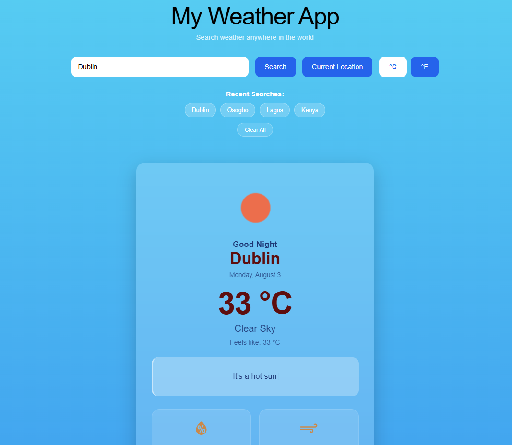

# 🌤️ Weather App

A responsive weather application built with **React.js** that provides real-time weather information and a five-day forecast using the **OpenWeather API**.

The app allows users to search for cities around the world, view their current weather conditions, use their current location, switch between Celsius and Fahrenheit, and quickly revisit recent searches.



## Features

* Search for weather by city name
* Get weather information based on your current location
* Switch between Celsius (°C) and Fahrenheit (°F)
* View a five-day weather forecast
* View detailed weather information including:

  * Humidity
  * Wind speed
  * Minimum temperature
  * Maximum temperature
  * Atmospheric pressure
  * Visibility
  * Sunrise time
  * Sunset time
* Weather-based recommendations
* Recent searches
* Clear recent searches
* Recent searches persist using browser `localStorage`
* Loading skeleton while weather data is being fetched
* Dynamic background based on current weather conditions
* Responsive design for desktop, tablet, and mobile devices
* Weather card animations and interactive hover effects
* Dynamic browser page title based on the searched city
* User-friendly error handling for invalid searches and API failures

## Built With

* **React.js**
* **Vite**
* **JavaScript (ES6+)**
* **CSS3**
* **React Icons**
* **React Simple Typewriter**
* **OpenWeather API**
* **LocalStorage API**

## Project Structure

```text
src/
├── assets/
│   └── website-preview.png
│
├── components/
│   ├── Forecast.jsx
│   ├── ForecastCard.jsx
│   ├── LoadingSkeleton.jsx
│   ├── RecentSearches.jsx
│   ├── SearchBar.jsx
│   ├── WeatherCard.jsx
│   └── WeatherDetails.jsx
│
├── services/
│   ├── forecastService.js
│   └── weatherService.js
│
├── utils/
│   ├── conversions.js
│   ├── formatting.js
│   └── weatherHelpers.js
│
├── App.jsx
├── App.css
├── index.css
└── main.jsx
```

## Getting Started

### 1. Clone the repository

```bash
git clone YOUR_GITHUB_REPOSITORY_URL
```

### 2. Navigate into the project

```bash
cd weather-app
```

### 3. Install dependencies

```bash
npm install
```

### 4. Set up your environment variables

Create a `.env` file in the root directory of the project:

```env
VITE_WEATHER_API_KEY=your_openweather_api_key
```

You can obtain an API key from OpenWeather.

> **Important:** Never commit your `.env` file or expose your API key publicly. The `.env` file is excluded from Git using `.gitignore`.

### 5. Start the development server

```bash
npm run dev
```

The application will be available at the local development URL provided by Vite.

## Build for Production

To create a production build:

```bash
npm run build
```

To preview the production build locally:

```bash
npm run preview
```

## Linting

Run ESLint with:

```bash
npm run lint
```

## What I Learned

Building this project helped me strengthen my understanding of:

* React component architecture
* React state management with `useState`
* Side effects with `useEffect`
* Working with REST APIs and asynchronous JavaScript
* `async/await` and error handling
* Geolocation API integration
* Conditional rendering
* Reusable React components
* Separating API logic into service files
* Separating helper functions into utility files
* Managing persistent data with `localStorage`
* Responsive CSS design
* Loading states and skeleton UI
* Dynamic document titles
* Git and GitHub workflow

## Future Improvements

Possible improvements for future versions include:

* Add hourly weather forecasts
* Add weather charts and visualizations
* Add automatic location detection on initial load
* Add multiple saved locations
* Add dark/light theme support
* Add more detailed weather alerts
* Improve accessibility
* Add automated tests

## Author

**Akinleye Idowu Joshua**

Frontend Developer | Data Analytics Enthusiast

Built with React.js and the OpenWeather API.

---

If you found this project useful or interesting, feel free to star the repository.
